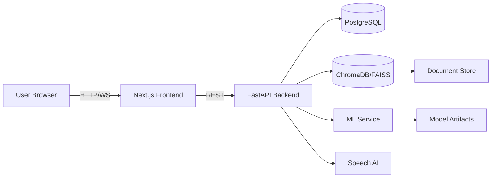

# CampusGPT AI Architecture

## Overview

CampusGPT AI is built as a split frontend/backend architecture.

- **Frontend:** Next.js + TypeScript + Tailwind CSS.
- **Backend:** FastAPI API server with JWT authentication, PostgreSQL data layer, and ML services.
- **ML & RAG:** Embedded in backend services using scikit-learn, sentence-transformers, and ChromaDB/FAISS.
- **Deployment:** Frontend deploys to Vercel, backend deploys to Render, and PostgreSQL is hosted on Supabase.

## High-Level Components

1. **Authentication Service**
   - JWT-based login and role-based access control.
   - Users: student, faculty, admin.

2. **Chat Service**
   - Real-time conversational UI.
   - Context-aware session memory.
   - Suggested questions and typing indicators.

3. **RAG Knowledge Base**
   - Document ingestion engine.
   - Embedding store using sentence-transformers.
   - Vector search with ChromaDB or FAISS.
   - Source retrieval and answer citations.

4. **ML Pipeline**
   - Intent classification with Logistic Regression, Naive Bayes, Random Forest.
   - Model evaluation dashboards for accuracy, precision, recall, F1, and confusion matrix.
   - Feature importance visualization.

5. **Recommendation Engine**
   - Course, scholarship, workshop, and event recommendations.
   - Personalized by user interest and conversation behavior.

6. **Admin Dashboard**
   - Document uploads, FAQ management, analytics, user management.

## Data Flow

1. User interaction arrives in the chat UI.
2. Frontend sends the message to the backend chat endpoint.
3. Backend performs NLP intent classification, entity extraction, and semantic retrieval.
4. RAG lookup finds relevant chunks from documents.
5. AI response is generated with context, user history, and source references.
6. Analytics and logs update in the database.

## Deployment Architecture

- **Vercel** for the frontend.
- **Render** for the backend.
- **Supabase PostgreSQL** for persistent storage.
- **ChromaDB/FAISS** for vector search.

### Diagram (Mermaid)

